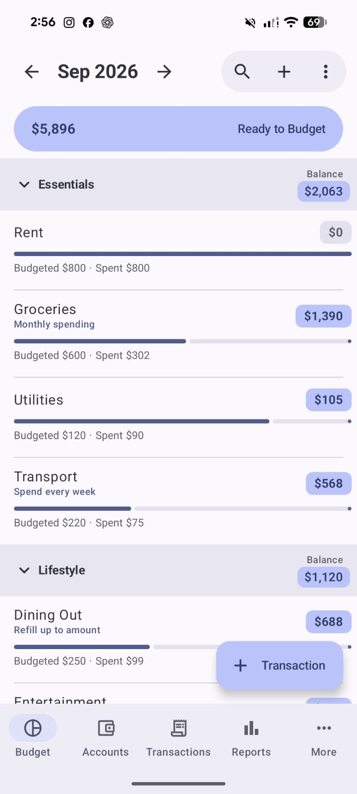
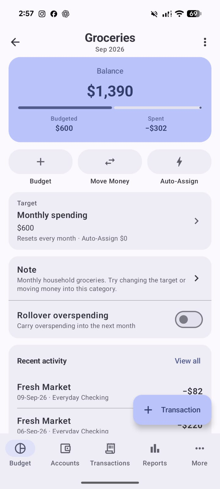
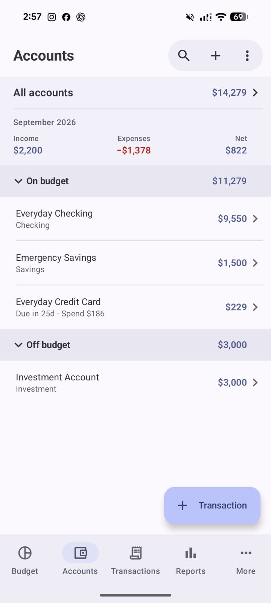
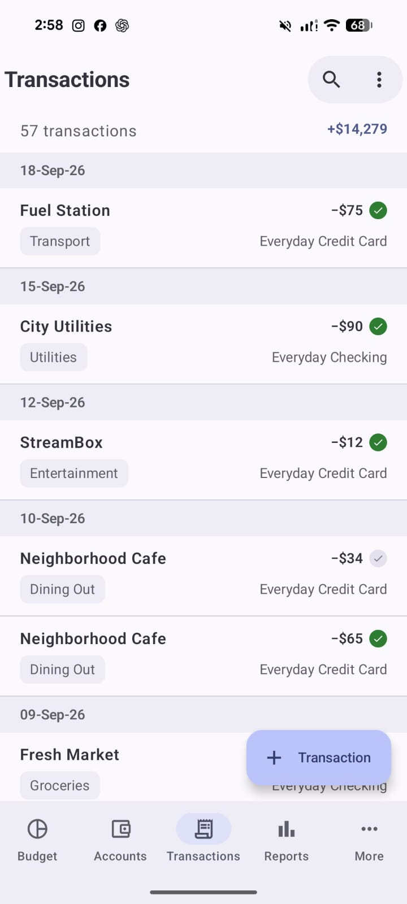
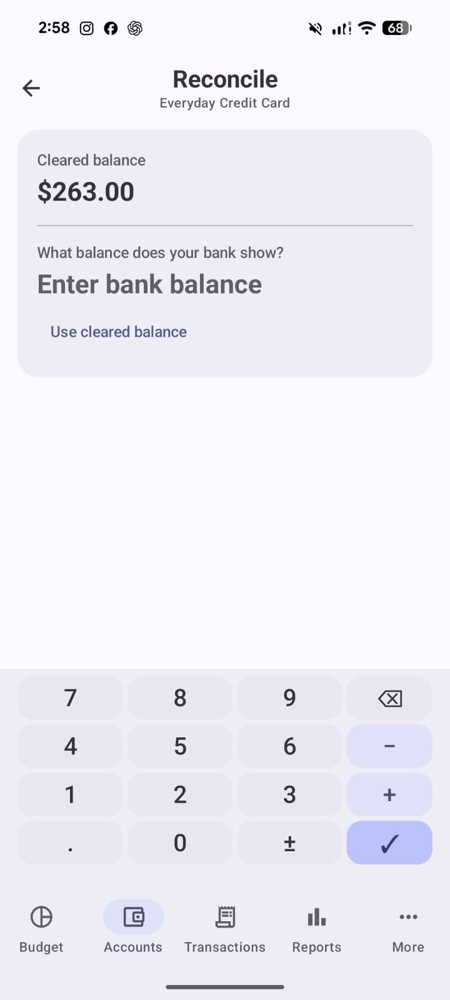
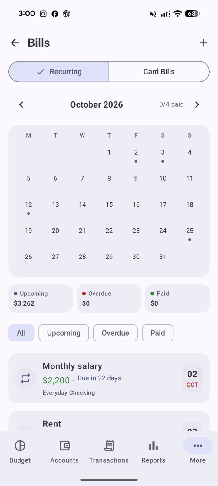

<div align="center">


# Actua

**A native Android client for [Actual Budget](https://actualbudget.org/), built with Kotlin and Jetpack Compose.**

<br>

<a href="https://github.com/azimul-kabir/actua/releases/download/v1.0.0-beta.12/Actua-v1.0.0-beta.12.apk"></a>
<a href="https://github.com/azimul-kabir/actua/releases/tag/v1.0.0-beta.12"></a>
<a href="LICENSE"></a>
<a href="https://github.com/azimul-kabir/actua/issues/new/choose"></a>
<a href="https://apps.obtainium.imranr.dev/redirect?r=obtainium://add/https://github.com/azimul-kabir/actua"></a>
<a href="https://discord.gg/FyGxRjmhw"></a>

<br><br>


</div>

## About this project

Actua is an independent, community-maintained Android project. Its development
was originally based on and informed by [Matt Farrell's open-source Actuali
project for iOS](https://github.com/MattFaz/actuali), whose tested behavior and
implementation remain important references.

Actua connects directly to a self-hosted Actual server. Budgets are downloaded
to local SQLite storage, remain usable offline, and synchronize through Actual's
encrypted CRDT protocol. There is no intermediary account or service operated
by this app.

Actua is not an official release of, affiliated with, endorsed by, or supported
by either the Actuali project or the Actual Budget team.

The Android interface is independently implemented with Jetpack Compose. Some
mobile interaction and layout decisions are inspired by familiar budgeting
apps, including [YNAB](https://www.ynab.com/), while being adapted to Material
You and Actua's Actual Budget workflow. Actua does not contain YNAB code or
artwork and is not affiliated with, endorsed by, or supported by YNAB.

## Screenshots

Explore a native Material You budgeting experience. All screenshots use
synthetic data from Actua's built-in demo budget. Select any image to view it
at full resolution.

<table>
  <tr>
    <td align="center"><a href="artwork/screenshots/budget-plan.jpg"></a><br><strong>Budget Plan</strong><br><sub>Targets, progress and balances</sub></td>
    <td align="center"><a href="artwork/screenshots/category-details.jpg"></a><br><strong>Category Details</strong><br><sub>Budget, move money and auto-assign</sub></td>
    <td align="center"><a href="artwork/screenshots/accounts.jpg"></a><br><strong>Accounts</strong><br><sub>On-budget, off-budget and cards</sub></td>
  </tr>
  <tr>
    <td align="center"><a href="artwork/screenshots/transactions.jpg"></a><br><strong>Transactions</strong><br><sub>Searchable, grouped activity</sub></td>
    <td align="center"><a href="artwork/screenshots/reconciliation.jpg"></a><br><strong>Reconciliation</strong><br><sub>Match Actua with your bank</sub></td>
    <td align="center"><a href="artwork/screenshots/bills-calendar.jpg"></a><br><strong>Bills Calendar</strong><br><sub>Recurring schedules and card bills</sub></td>
  </tr>
</table>

## Current functionality

- Password connection to an Actual server plus budget creation, download, selection, and confirmed server deletion
- Offline local budget storage and encrypted CRDT synchronization
- Local-only demo budget that can be opened without a server and reset at any time, with realistic accounts, six months of transactions, credit-card activity, transfer payments, reconciliation states, category targets, rules, scheduled transactions, notes, and report dashboard data
- Automatic, foreground, post-mutation, and manual sync
- Budget table and availability-focused Plan views, category groups, Source of Fund/Income, monthly amounts, progress bars, and hide/show management
- Account lists, current/cleared/uncleared/reconciled balances, notes, monthly summaries, and full transaction history
- Expense, income, transfer, editable split, edit, clear, and delete transaction flows
- Full-screen searchable account, payee, and category selection with live alphabetical
  results, account balances, transfer grouping, and new-payee creation
- Ready to Assign/To Budget assignment plus category-to-category and category-to-budget money movement
- Calculator-style and conventional amount entry
- Inline transaction calculator expressions with predictable backspace editing that remain visible until confirmation
- Account, category, and group creation plus working contextual actions
- Automatic local backup, validated archive import, restore, retention, pre-restore revert,
  per-archive export, and optional folder mirroring
- Live sync status with last successful sync and last scheduled background refresh
- Actual-compatible rule listing, editing, CRDT mutations, and transaction
  processing for supported standard conditions and actions
- Scheduled transaction creation and review with lifecycle status, recurring
  schedule actions, a dedicated repeat-pattern editor, and linked transaction
  history with unlinking, recurring-transaction discovery, and a monthly Bills
  calendar for recurring schedules and configured credit-card due dates
- Persistent hide-reconciled filtering across transaction lists and searches
- Balance-focused category details with shared Budget, Move Money and Auto-Assign keypads, notes, rollover overspending, recent activity and category-preselected transaction entry
- Credit-card limits, billing-cycle metadata, fixed or offset due dates, cycle spending,
  urgency sorting, and opt-in Android payment reminders
- Actual-synced report dashboard pages and widget order, with Summary, Net Worth,
  Cash Flow, Spending, Markdown, Age of Money, Formula, Custom Report, Calendar,
  Crossover, Budget Analysis, Sankey, Balance Forecast, and Monte Carlo widgets
- Configurable display currency, decimals, appearance, start page, account summaries,
  transaction grouping, and Material bottom-navigation labels
- Global search across transactions, accounts, payees, categories, notes, and transfers
- Unified Material You category budgeting with synced targets, target-aware auto-assign, money movement, details, and recent activity
- Preview-first whole-budget application for supported category targets, including multiple
  contributions, upstream priority order, refill caps and available-funds clamping, with atomic
  CRDT writes, separate safe Apply and explicit Overwrite actions, and disclosure of unsupported
  advanced automations
- Multi-automation category editing for fully supported UI-managed targets, including goal-only
  balance targets that do not automatically budget money, while unknown and notes-managed
  definitions remain safely read-only
- Expandable inline Auto-Assign and Move Money controls within the category amount keypad
- Account-specific transaction entry, collapsible account summaries and notes, and configurable bottom navigation labels
- Mobile account reconciliation with bank-balance comparison, uncleared review, adjustments, and cleared-transaction locking
- Material You motion for tab changes, detail navigation, searches, and expandable sections
- Android-style per-tab navigation state, root reselect behavior, scroll-to-top actions, and contextual Back restoration
- Responsive Material You home-screen widgets for monthly budget snapshot, favourite categories,
  quick expense/income/transfer entry, and account balances, including practical 2x2 layouts and
  compact 3x1/4x1 forms for Budget Snapshot and Quick Transaction
- Launcher long-press shortcuts for adding an expense, income, or transfer and opening global search
- Manual **Build Test APK** GitHub Actions workflow that produces a separate **Actua Test** app
  (`com.azimulkabir.actua.test`) for side-by-side development testing without publishing a release

See [BACKEND_PARITY.md](BACKEND_PARITY.md) for the implementation boundary and detailed port status.

## Demo budget

Actua includes a built-in **Actua Demo Budget** for evaluating the app without connecting to an Actual server. Open **More → Connection & Data** and tap **Try demo budget**. When the demo is active, the same control becomes **Reset demo budget**, which recreates the sample data from the current Actua schema.

The demo is a real local Actual-compatible SQLite budget, not a mocked UI. It includes checking, savings, credit-card and off-budget investment accounts; realistic transaction history; paired credit-card payment transfers; cleared, uncleared and reconciled states; several category target types; payee categorization rules; recurring scheduled transactions; notes; and dashboard report data. Normal Actua screens and write paths operate on it, so it can be edited and explored like any other downloaded budget.

The demo uses the reserved local budget ID `demo`. It has no `cloudFileId`, `groupId`, or encryption registration, and Actua explicitly prevents the demo budget from entering the server sync path. Creating or resetting it does not upload, modify, or delete any server budget.

## Scope

The goal is behavioral compatibility with Actual Budget and with portable
budgeting behavior proven by Actuali, while retaining a native Android UI built
with Jetpack Compose. Changes in the iOS project can be reviewed and ported over
time, but this is a source-level reimplementation, not shared Swift code or a
byte-for-byte conversion.

Apple-platform integrations are deliberately excluded, including FinanceKit, Apple Wallet, Siri, App Intents, Shortcuts, iCloud, Keychain, and Apple background-task APIs. Android equivalents are used only where they serve the core budgeting workflow, such as Android Keystore and WorkManager.

## Requirements

- Android 9 (API 28) or later
- A reachable self-hosted Actual Budget server for synchronized real budgets; the built-in demo budget works without a server
- Android Studio with JDK 11 or later for local builds

## Before testing with a real budget

> [!CAUTION]
> **Actua is beta/testing software and can write changes back to a synchronized Actual budget. Create an independent backup of your Actual budget before connecting or opening that budget in Actua.** Keep the backup outside Actua, using Actual's own backup/export process or another trusted backup method, so it remains available even if the phone, local database, app installation, or sync state is damaged.

For the safest first look, use **More → Connection & Data → Try demo budget**. The demo is local-only, has no cloud registration, and is blocked from the server sync path.

Actua also includes automatic local backups, retained backup history, restore, a one-tap pre-restore revert, per-archive export, optional folder mirroring, and live sync status. These are useful recovery layers, but **they are not a substitute for an independent backup created before testing Actua with an important budget**.

While Actua remains in beta, confirm important edits have synchronized before deleting a budget, disconnecting/resetting the app, uninstalling it, or moving between builds. Keep a known-good Actual client and your independent backup available until you are satisfied with the result.

## Testing releases

Testing APKs are published on the [GitHub Releases page](https://github.com/azimul-kabir/actua/releases). The current testing release is [Actua 1.0.0-beta.12](https://github.com/azimul-kabir/actua/releases/tag/v1.0.0-beta.12). Download the APK on an Android device, allow installation from the browser or file manager when prompted, and open Actua.

For unreleased branches and PRs, use **Actions → Build Test APK**. The resulting **Actua Test** APK uses `com.azimulkabir.actua.test`, installs beside normal Actua, and has separate Android local app data. It does not create a GitHub release, tag, Obtainium update, or Discord release notification. See [docs/TEST_APK.md](docs/TEST_APK.md).

Actua can also be added directly to [Obtainium](https://apps.obtainium.imranr.dev/redirect?r=obtainium://add/https://github.com/azimul-kabir/actua) for update notifications and in-place APK upgrades from GitHub Releases. While Actua releases are marked as beta/prerelease, enable **Include prereleases** for the Actua source in Obtainium.

Actua uses the application ID `com.azimulkabir.actua`. Android therefore treats
it as a separate app from the earlier Actuali for Android alpha builds. Confirm
that local changes are synchronized and backed up before removing an older build.

Starting with the first persistently signed release, later GitHub release APKs
can upgrade it in place. Builds published before that transition used ephemeral
GitHub runner debug keys and cannot be upgraded by the new release key. Before
installing the first persistently signed APK, synchronize and back up Actua,
uninstall the older build once, and install the new APK. Keep that installation
for normal in-place upgrades afterward.

## Build and test

```bash
./gradlew assembleDebug
./gradlew testInstrumentedUnitTest lintDebug
./gradlew installDebug
```

The app can then connect from **More → Connection & Data**. Use the complete server URL and password, then create a budget or choose an existing remote budget. To explore Actua without a server, use **Try demo budget** on the same screen. The Backups manager can import and validate an exported archive without changing the active budget, export individual archives, and mirror retained backups to a persistent folder selected through Android's system picker. An imported backup is restored only after a separate confirmation, with the current budget preserved for one-tap revert.

## Architecture

```text
Jetpack Compose UI
        ↓
ActuaRepository
        ↓
Local SQLite database ← CRDT mutation writers
        ↕
Actual sync client ← encrypted protobuf sync → Actual server
```

Writes are applied locally and represented as Actual-compatible CRDT messages. WorkManager provides Android-native periodic synchronization and backup scheduling. The built-in demo follows the same local database model but is intentionally detached from cloud identity and blocked from synchronization.

## Upstream relationship and credits

Actua began as an Android reimplementation based on **[Matt Farrell's Actuali
for iOS](https://github.com/MattFaz/actuali)**. Its product design, tested
behavior, Swift implementation, documentation, and sync work continue to guide
portable behavior. Please use the original repository for the iPhone and iPad
app and direct iOS-specific contributions and issues there. Copyright attribution
from the upstream repository is preserved in this project's license.

Actuali itself builds on **[Actual Budget](https://github.com/actualbudget/actual)**. Portions of the synchronization behavior derive from Actual Budget's MIT-licensed CRDT and loot-core implementations, originally copyrighted by James Long and subsequent contributors.

The original Actuali icon was designed by
**[u/bdownz](https://www.reddit.com/user/bdownz/)**. Actua uses a new,
independently created adaptive icon and does not reuse that artwork.

Some interaction patterns and visual ideas were informed by
**[YNAB](https://www.ynab.com/)**, particularly its mobile-first approach to
transaction entry and budgeting controls. These ideas were independently
implemented for Android using Material You; no YNAB source code, artwork, or
branding is included. YNAB is a separate product and does not endorse or
support Actua.

See [NOTICE.md](NOTICE.md) and [LICENSE](LICENSE) for complete attribution and license terms.

## Contributing

Every development change starts with a GitHub issue describing its scope and
acceptance criteria. Create the implementation branch only after that issue exists,
then open a pull request linked to the issue. Please do not develop directly on
`main` or submit an unlinked development PR.

Android bug reports and port-specific contributions belong in this repository. When implementing parity behavior, link the relevant upstream Actuali source, test, issue, or commit where possible. Do not report Android-port problems in the original iOS repository unless the same issue is reproducible in the iOS app.

## License

MIT. This repository contains work derived from Actuali and Actual Budget; their copyright notices are retained in [LICENSE](LICENSE).
