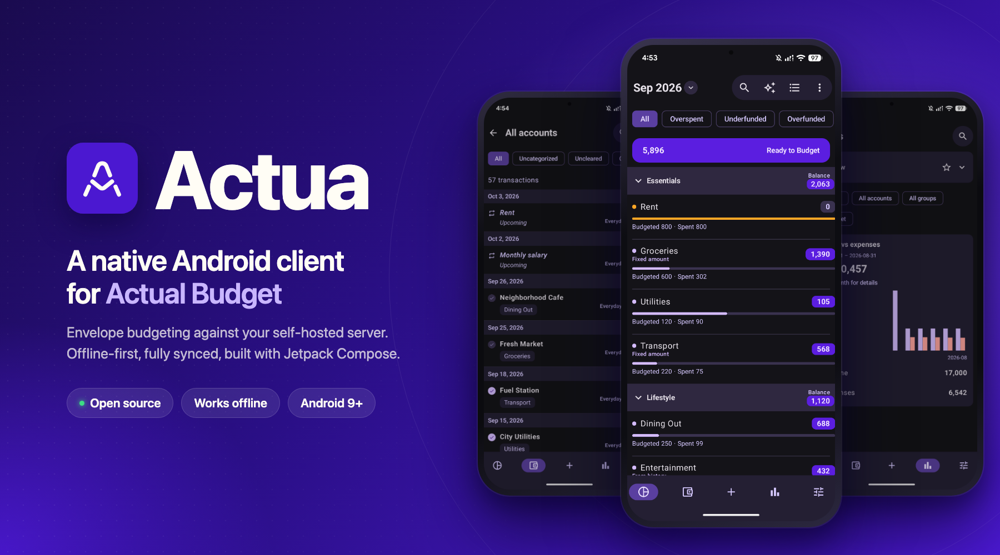
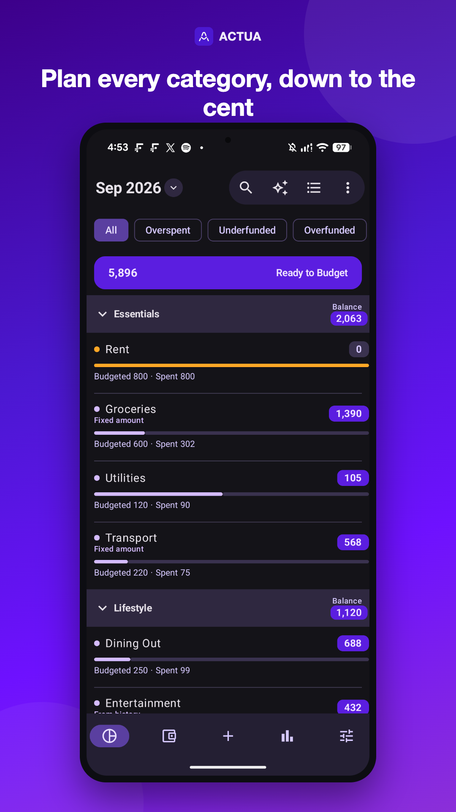
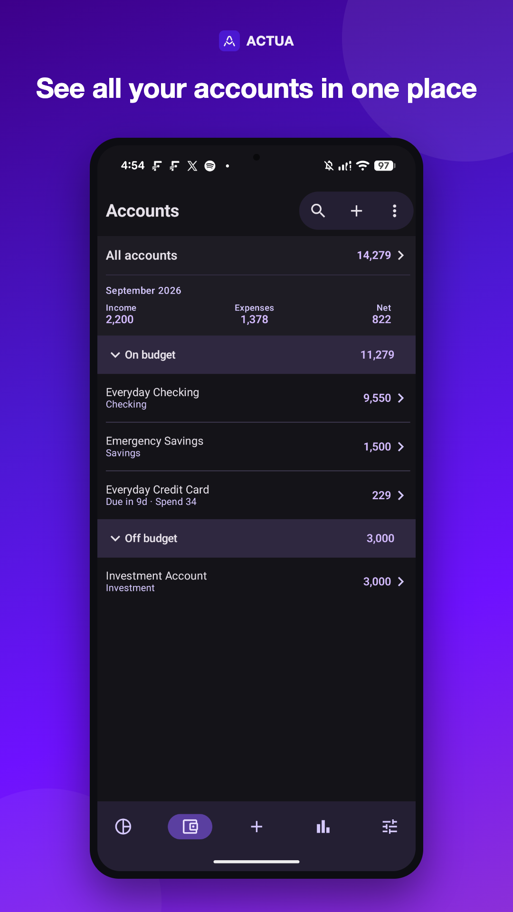
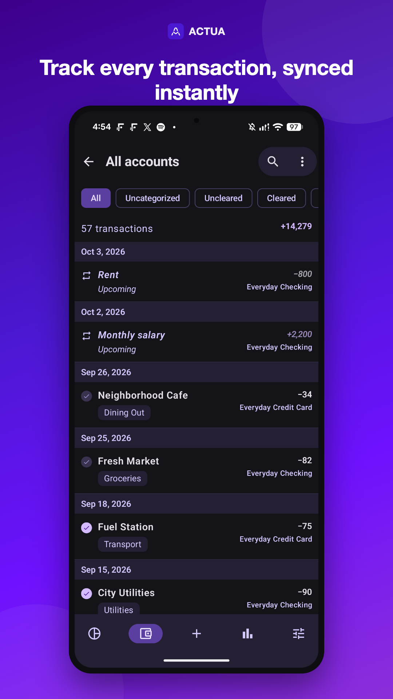
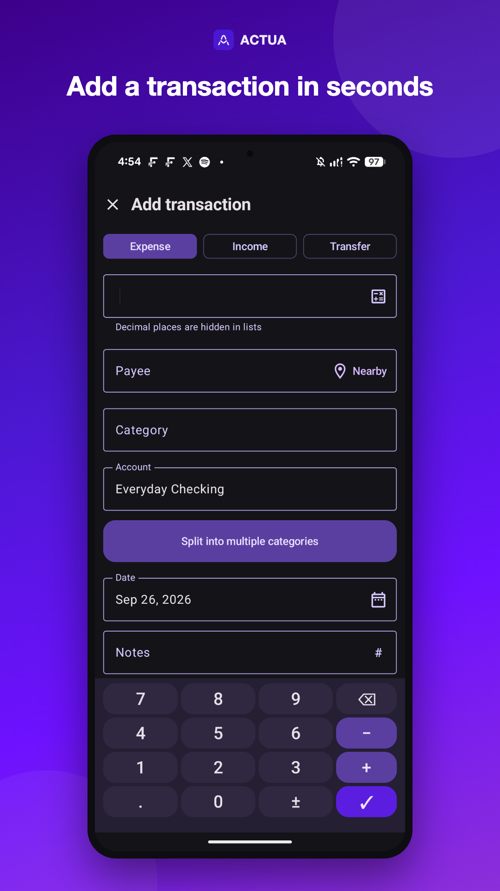
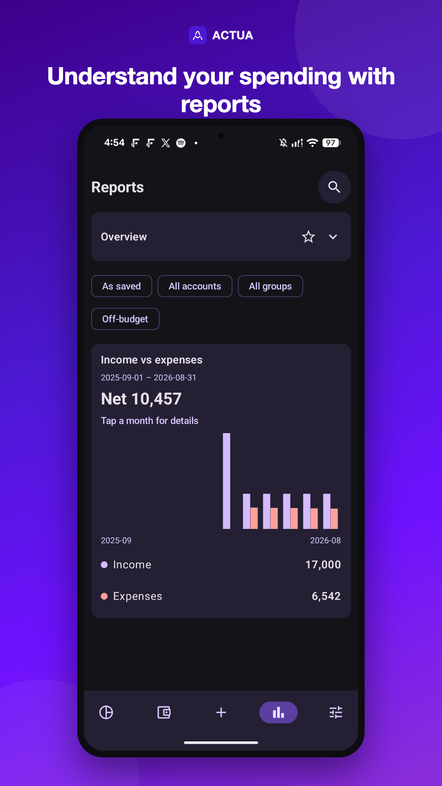
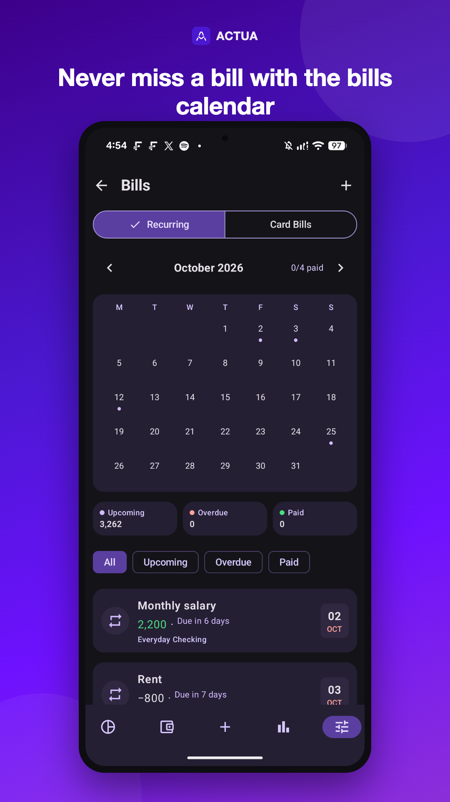
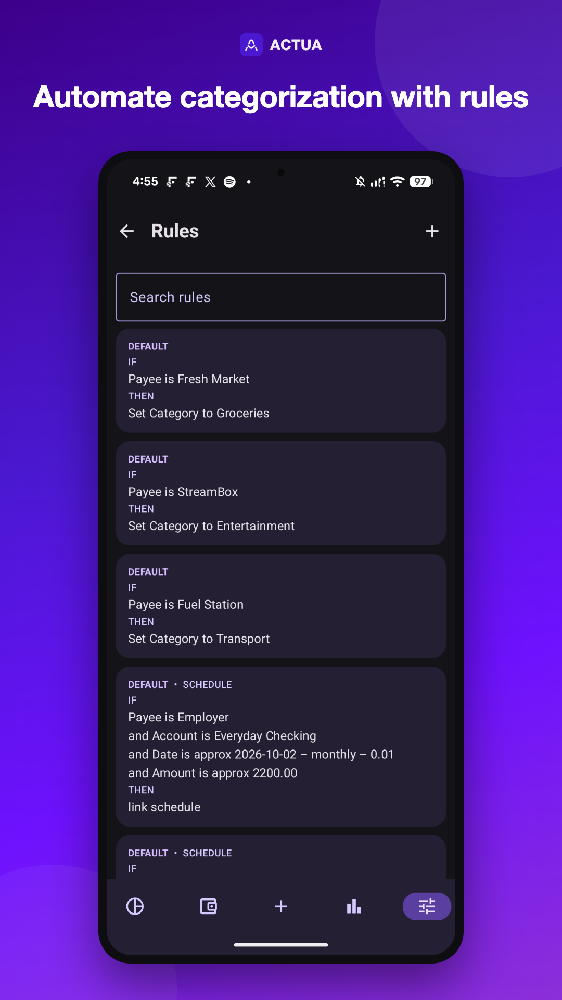
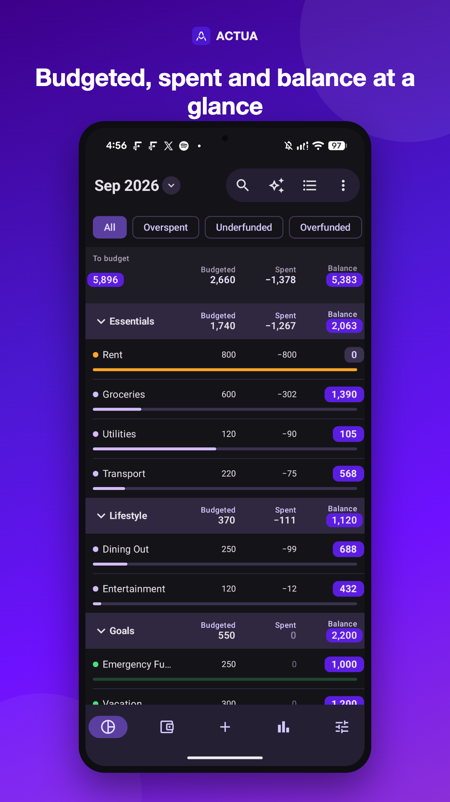

# Actua

**A native Android client for [Actual Budget](https://actualbudget.org/), built with Kotlin and Jetpack Compose.**

[Website](https://actua.pages.dev) • [Download APK](https://github.com/azimul-kabir/actua/releases/latest) • [Obtainium](https://apps.obtainium.imranr.dev/redirect?r=obtainium://add/https://github.com/azimul-kabir/actua) • [Discord](https://discord.gg/FyGxRjmhw) • [Report an issue](https://github.com/azimul-kabir/actua/issues/new/choose)

  

## About

Actua brings Actual Budget to Android with a native Material You interface.

It connects directly to your self-hosted Actual Budget server, keeps a local copy of your budget for offline use, and synchronizes changes with Actual.

Actua is an independent community project and is not affiliated with or endorsed by Actual Budget.

## Features

- Native Material You Android interface
- Home dashboard with an at-a-glance financial overview (ready to budget, favorite categories/accounts, upcoming bills, this month, reports and recent activity), customizable via show/hide and drag-to-reorder, with an optional start day for the This Month summary to match mid-month pay cycles
- Customizable bottom tab bar: show/hide and reorder tabs (Reports can be added as its own tab), plus an optional "Add" quick-add tab
- App-wide favorites for categories, accounts and reports, shared by Home, the Budget favorites filter and the home-screen widget
- Password and OpenID/OIDC login
- Offline budgets with encrypted Actual sync
- Budgeting, categories and money movement, including one-tap cover for overspent categories and Actual's budget actions (3/6/12-month averages, copy last month or to year end, hold income)
- Transactions, splits, transfers, merging duplicates and reconciliation, including "Use last synced total" for bank-synced accounts
- Bank sync through your Actual server (SimpleFIN and GoCardless), plus experimental Enable Banking for European banks
- Category targets and budget automations, including `#template` notes, checked against Actual's own template engine
- Scheduled transactions and Bills calendar
- Accounts with group totals, credit cards and payment reminders
- Actual dashboard and saved custom reports (read-only), with donut and per-interval charts, optional total and average per period, date/account filtering and drill-down to transactions
- Rules and automatic categorization, run on manual entry, transfers, imports and bank sync as in Actual, including template, formula and split actions created in Actual
- CSV, XLSX, PDF, SMS and notification imports, plus [Tasker intents](docs/TRANSACTION_IMPORTS.md#tasker-and-other-automation-apps)
- Payee management (rename, merge, delete, favorite, category learning), with suggested and location-aware payees
- Global search, and transaction search that also matches amounts and dates
- Automatic local backups and restore
- Home-screen widgets and launcher shortcuts
- Currency, date and number formats that follow your budget's Actual settings or a device override, plus appearance options with an optional Material You dynamic-color mode (Android 12+)
- Actual tag management, with colored `#tag` rendering, notes autocomplete, a Manage Tags screen, and tap-a-tag transaction filtering
- Multiple downloaded budgets with a quick switcher in Manage
- Built-in local demo budget
- Privacy-safe Diagnostics report you can copy, save or email when reporting a problem

See [BACKEND_PARITY.md](BACKEND_PARITY.md) for detailed compatibility and implementation status.

## Screenshots

<table>
  <tr>
    <td align="center" width="25%">
      
    </td>
    <td align="center" width="25%">
      
    </td>
    <td align="center" width="25%">
      
    </td>
    <td align="center" width="25%">
      
    </td>
  </tr>
  <tr>
    <td align="center" width="25%">
      
    </td>
    <td align="center" width="25%">
      
    </td>
    <td align="center" width="25%">
      
    </td>
    <td align="center" width="25%">
      
    </td>
  </tr>
</table>

## Try Actua

Actua requires **Android 9 or newer**.

Download the latest APK from [GitHub Releases](https://github.com/azimul-kabir/actua/releases), or add Actua to Obtainium for update notifications and in-place upgrades.

Don't have an Actual server handy? Open **Manage → Connection & Data → Try demo budget** to explore Actua using a completely local sample budget.

> [!CAUTION]
> Actua can write changes to your synchronized Actual budget. Back up important budgets before connecting a new client.

## Credits

Actua was originally based on and informed by [Actuali](https://github.com/MattFaz/actuali), the open-source iOS client by Matt Farrell.

The project aims for compatibility with [Actual Budget](https://actualbudget.org/) while providing an independently implemented native Android experience.

## Community

Found a bug or have an idea? [Open an issue](https://github.com/azimul-kabir/actua/issues).

Want to discuss Actua, test beta builds, or help with development? [Join the Discord server](https://discord.gg/FyGxRjmhw).

## License

Actua is available under the [MIT License](LICENSE).
